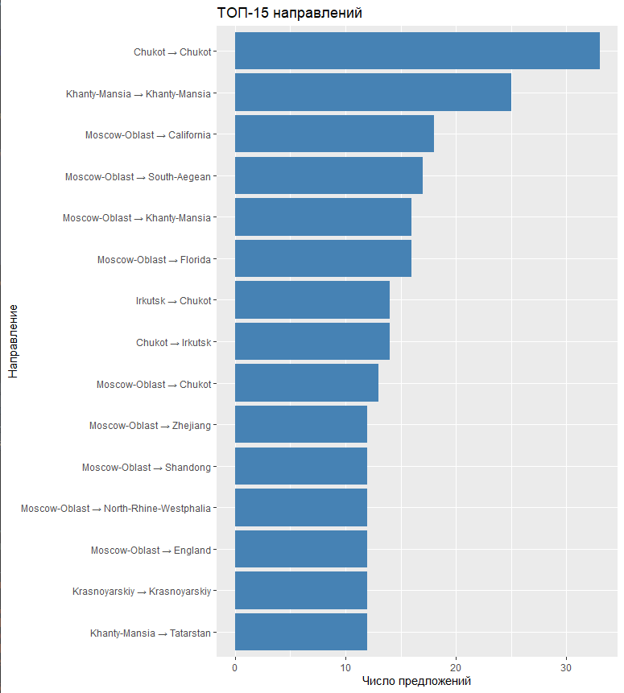
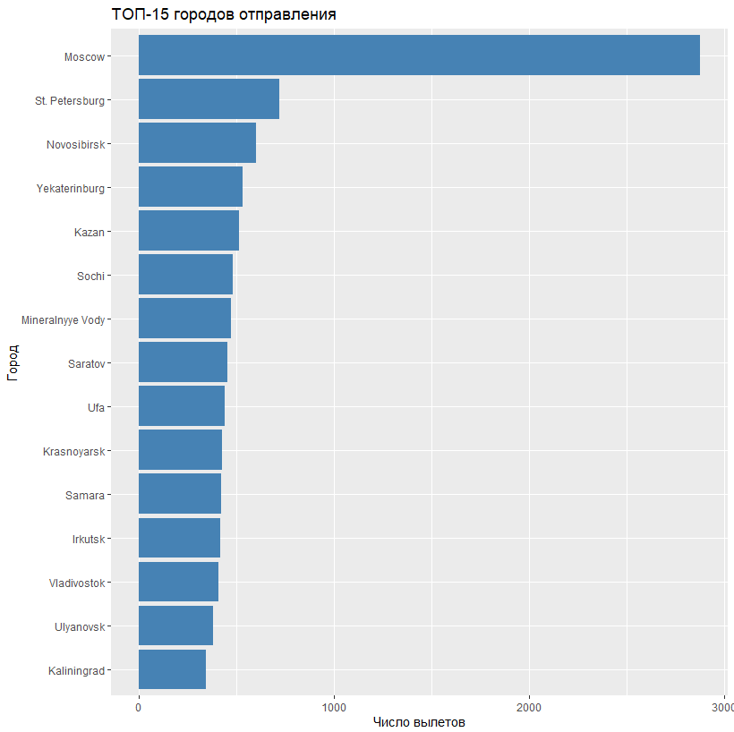
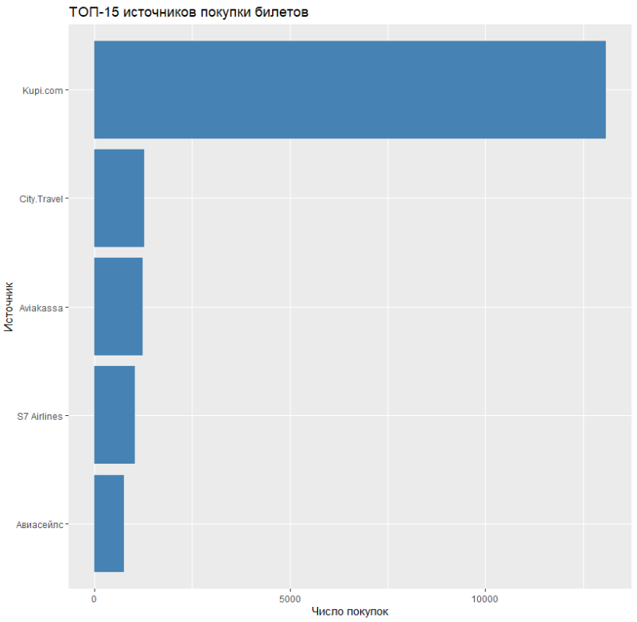
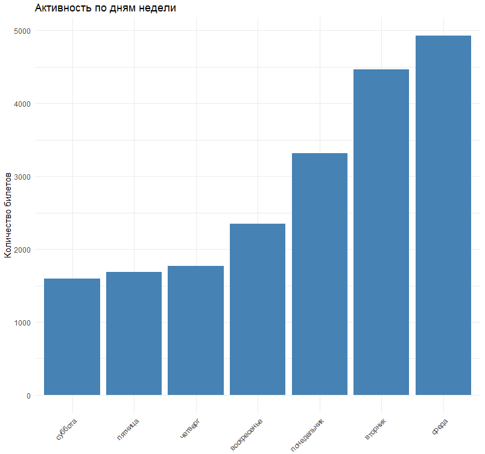
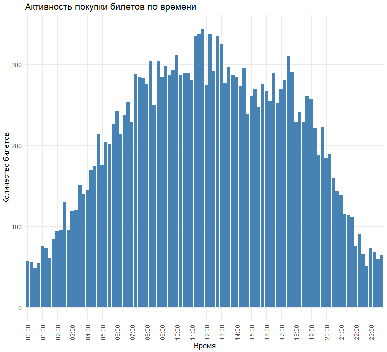

# ✈️ Анализ и визуализация авиаперелётов

Этот проект позволяет загрузить, очистить, объединить и визуализировать данные о перелётах с указанием направлений, источников покупки билетов, временной активности и подготовить данные для отображения маршрутов на карте в QGIS.

## 📦 Зависимости

Проект написан на языке **R** и требует следующих библиотек:

-   library(dplyr)

-   library(ggplot2)

-   library(readr)

-   library(jsonlite)

-   library(tidyr)

-   library(lubridate)

## 📁 Структура данных

-   **`flights_df.csv`** — основной CSV-файл с информацией о перелётах: коды аэропортов отправления/назначения, даты, источники покупки и др.
-   Источник данных: Travelpayouts API (Aviasales)

-   **Аэропорты** — данные загружаются из [mwgg/Airports](https://github.com/mwgg/Airports) (в формате JSON).

## ⚙️ Основные шаги обработки

1.  **Загрузка и очистка** данных о перелётах.

2.  **Загрузка справочника аэропортов** (с координатами, странами, городами).

3.  **Объединение** данных о рейсах с географическими координатами аэропортов.

4.  **Классификация** рейсов по типу (внутренний, международный и др.) и по сезону.

5.  **Визуализация**

    -   Какие самые популярные направления?

        

    -   Из каких городов чаще всего вылеты?

        

    -   Какие источники лидируют в количестве проданных билетов?

        

    -   В какие дни чаще всего покупают билет?

        

    -   В какое время чаще всего покупают билеты?

        

6.  **Подготовка OD-таблицы** (Origin-Destination) с координатами для QGIS.

